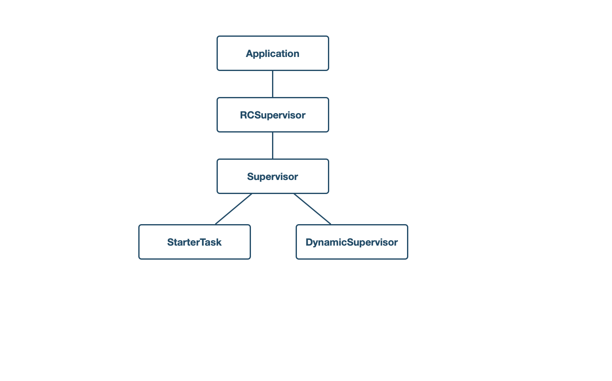
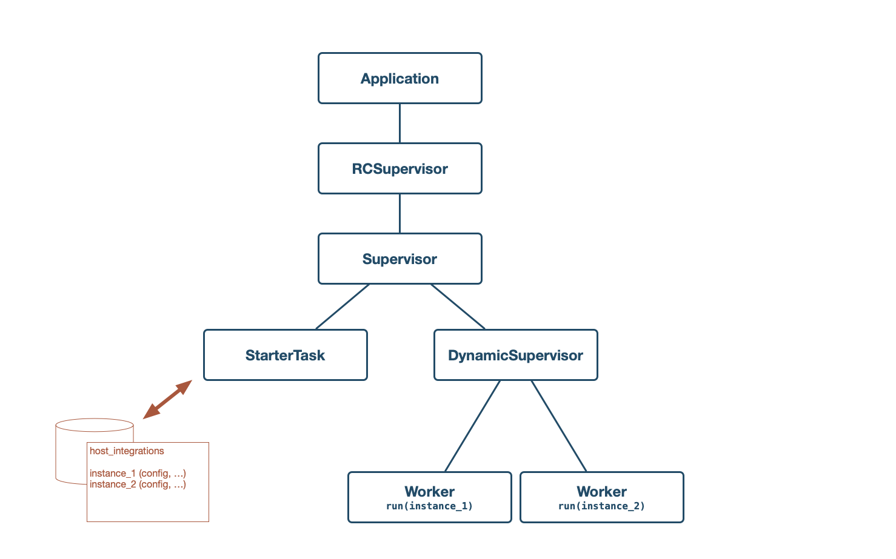
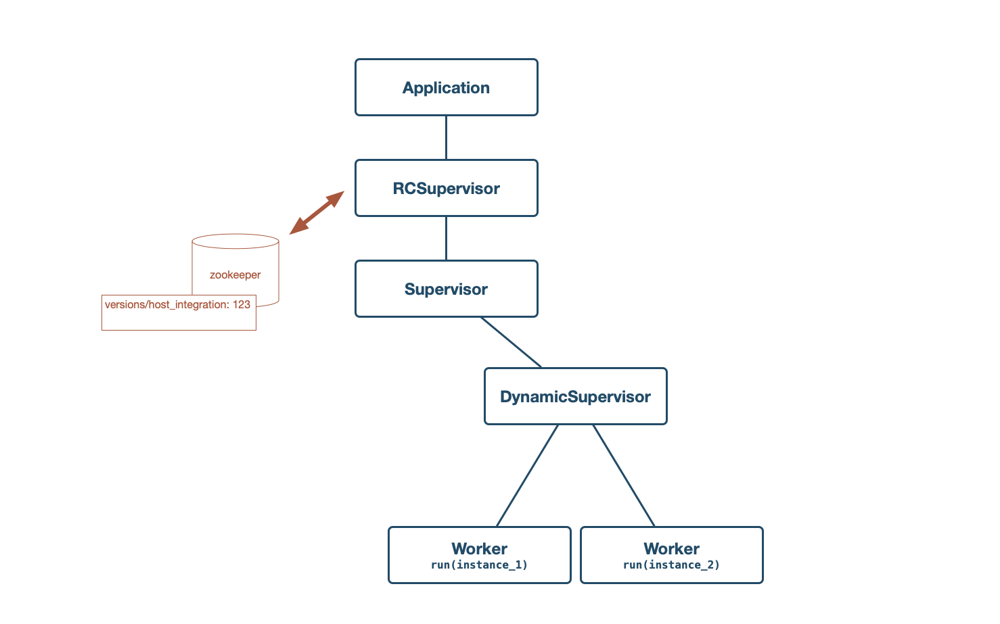
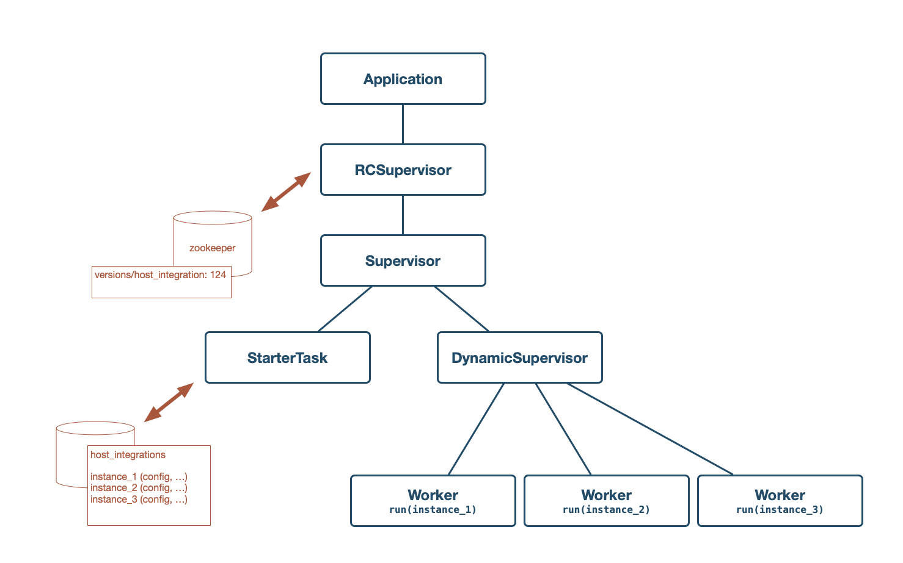

footer: hello@funnelcloud.io

[.hide-footer] 
#[fit] The Best Of Both Worlds
##[fit] Lessons Learned Extending Rails With Elixir
##<br>
##<br>
### Mat Trudel / mat@funnelcloud.io
---
[.hide-footer] 


---
# FunnelCloud is an MES
#### (Manufacturing Execution System)
[.build-lists: true]

* Gathers data from factory floor
* Tracks, reports & alerts on manufacturing metrics
* Coordinates domain processes
* Many distinct interfaces, both human & machine
* Very expansive domain, but well modeled

---
# Deployment Environment

* Hosted on-prem, provided as a VM image
* Relatively low volume traffic-wise
* Fixed vertical scale 
* *Extremely* high QoS requirements
* Quarterly releases (plus the occasional hot-fix)

---
# History

* Started about 5 years ago as a Rails app
* As we grew to understand the domain more, realized that web interface is only a small part of the product
* What we frequently needed were things Ruby / Rails are ill-suited for

---
# And Then Came Elixir

* Needed to develop first-class patterns for queue processing, batch jobs, deep async dependencies, etc.
* After a few forays into background Ruby, Scala and others, settled on Elixir
* Life got a *lot* easier

---
# Where We Are Today

* Web front-end is still Rails
* Most queue and schedule-based work done in Elixir
* *Vast* majority of net new work done in Elixir
* Slow, patient migration of existing functionality
* We would do this again in a heartbeat

---
# 3 Lessons Learned

---
#[fit] Lesson #1: Lean On Your Database

* Share model schemas between Rails / Ecto
* One of Rails / Ecto responsible for all migrations
* No automated syncing of schemas

---
#[fit] Lesson #1: Lean On Your Database
## Pros

* Develop quickly & in relative isolation
* Idiomatic tooling everywhere
* Easy to test & reason about
* Unlocks Postgres' superpowers

---
#[fit] Lesson #1: Lean On Your Database
## Cons

* ActiveRecord's magic is frequently a liability (Dates & Times, STI, Polymorphism)
* Validation logic duplicated
* Transactional thinking is critical (a good thing!)
* Lots of 'companion' PRs

---
#[fit] Lesson #1: Lean On Your Database
## Overall, A Win

* Works reasonably well as long as you stay on top of your schemas
* Probably wouldn't recommend to larger teams
* Requires looking 'beyond the ORM' and *using* the database more
* Postgres is *amazing* & we should use more of it

---
#[fit] Lesson #2: Conscious Decoupling

* Identify async dependencies in Rails and factor them out
* Use message queues & a CQRS approach to decouple
* Individual applications produce / consume as needed w/ little ceremony
* We use Kafka for its durability & multiple consumer offset support

---
#[fit] Lesson #2: Conscious Decoupling
## Pros

* Very ergonomic escape hatch from Rails
* CQRS model plays to Elixir's strengths
* Naturally surfaces opportunities for concurrency

---
#[fit] Lesson #2: Conscious Decoupling
## Cons

* Railsisms can make discovery difficult
* Doesn't easily accommodate sync patterns
* Need to be sure your decomposition is correct up front

---
#[fit] Lesson #2: Conscious Decoupling
## Overall, A (Qualified) Win

* Great way to handle impedance mismatch between Rails and Elixir
* Can be harder to reason about, especially in production
* Difficulties remain around tooling & runtime visibility

---
#[fit] Lesson #3: Migrate Feature-Wise

* Tackle discrete features one at a time
* Treat them as constrained & focused rewrites
* Don't necessarily aim for 1:1 duplication
* Exploit the opacity of shared interfaces (DB, message queues)

---
#[fit] Lesson #3: Migrate Feature-Wise
## Pros

* Done well, provides a do-over for free
* Allows for sensible migration of existing deployments (no flag days)
* Fits very well with umbrella apps & DDD principles

---
#[fit] Lesson #3: Migrate Feature-Wise
## Cons

* Most of legacy works fine; requires a clinical detachment to not get carried away
* Existing features & implementation patterns are often premised on Railsisms
* Requires developers to grok two code bases, different subtleties, bugs, &c

---
#[fit] Lesson #3: Migrate Feature-Wise
## Overall, A Win By Default

* Full rewrites are impossible
* Requires a deep understanding of existing stack to plan, execution usually straightforward
* Useful set of Elixir patterns quickly emerge

---

# In-Depth Example: Host Integration

---
[.build-lists: true]
# Host Integration Background

* Passes domain events up to ERP 'host systems' (SAP, CMS, etc)
* Implemented in Elixir as a Kafka consumer of `events` queue
* Configured based on record(s) in `host_integrations` table
* Configuration & mappings loaded at startup for performance

---
[.hide-footer] 


---
[.hide-footer] 


---
[.hide-footer] 


---
[.hide-footer] 


---
[.hide-footer]



---
[.hide-footer] 

```ruby
class HostIntegration < ActiveRecord::Base
  include Reloadable

  after_commit -> { reload_remote_process(:host_integration) }
  
  ...
end

module Reloadable
  def self.included(base)

    define_method 'reload_remote_process' do |app|
      zk = Zookeeper.new()
      zk.set(path: "/versions/#{app}", data: Time.current.to_i.to_s)
      zk.close
    end
  end
end
```

---
[.hide-footer] 


---
[.hide-footer] 


---
[.hide-footer] 


---
[.hide-footer] 


---
[.hide-footer] 


---
# The Best Of Both Worlds

* No style compromises
* Totally idiomatic Elixir
* Rails implementation is dead simple
* Interface is easily inspectable

---
[.build-lists: true]
# Wrapping Up

* Venerate your sources of truth
* Decouple ruthlessly
* Stay idiomatic everywhere
* Don't fix what isn't broken

---
[.hide-footer] 
## Come Work With Us!
### hello@funnelcloud.io
