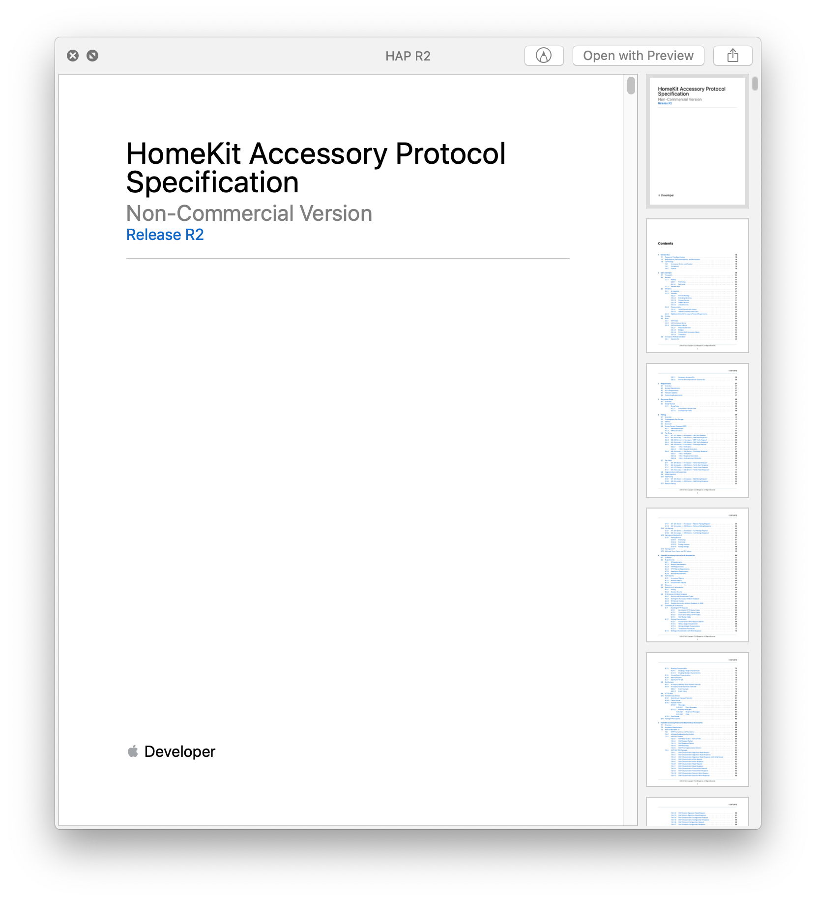

theme: Inter
text: #EEEEEE
code: auto(42), Monaco, line-height(1.2)
footnote: #EEEEEE, text-scale(1.4)
footer-style: #EEEEEE, text-scale(3)

# Thousand Island
## The first in a 4 part yak shave[^1]
### @mattrudel - github.com/mtrudel - mat@geeky.net

[^1]: yak shave (noun): Any apparently useless activity which, by allowing you to overcome intermediate difficulties, allows you to solve a larger problem.

---
[.build-lists: true]
# Thousand Island
### A pure Elixir socket server, embodying OTP ideals

* Sits underneath an e.g. HTTP server
* Listens for client connections over TCP
* Hands them off to an upper protocol layer
* Provides send / receive / &c functionality
* Handles transport concerns (TLS, connection draining, etc)
* Does this efficiently and scalably

^ But before we talk about this, we'll need a bit of context
^ This isn't just a really about Thousand Island, it's really a talk about yak shaving and air conditioners

---
## This is a talk about an
# Air Conditioner

---


^ We have one of these units in our house, and like most of them, it comes with a remote like this

---
[.background-color: #444444]


^ It's functional, but not much more. You never use it enough to remember which buttons are which, and more notably, there's no ability to use it out of the house. 
^ I can fix this; I'll make an IR blaster to control it via a RPi, over the internet

---

# What I want to build

^ I did a voice-assistant startup last year and there's no way I'm letting Amazon or Google into my home

---
# What I want to build


---
# How to build a custom HomeKit accessory?

* Homebridge

^ worst kind of javascript one size fits all tire fire, so nope.

---
# How to build a custom HomeKit accessory?

* ~~Homebridge~~
* HAP-Python

---
# How to build a custom HomeKit accessory?

* ~~Homebridge~~
* ~~HAP-Python~~
* Numerous C libs

---
# How to build a custom HomeKit accessory?

* ~~Homebridge~~
* ~~HAP-Python~~
* ~~Numerous C libs~~
* I've been meaning to play with Nerves anyway, so...

---
## [fit] So... I guess I'm writing a HomeKit library?

---
## This is a talk about an 
# ~~Air Conditioner~~
# HomeKit Library

^ Alright, this'll be fun.

---
[.footer: ## https://github.com/mtrudel/hap]
# HAP
## HomeKit for Elixir & Nerves

---
[.background-color: #444444]


---
[.background-color: #444444]


---
## HomeKit devices run an HTTP server


^ There's a problem

---
## HomeKit devices run a *non-standard* HTTP server 


^ The long and short of it is that we need to do encryption directly on the socket connection. This isn't SSL, but rather a simpler symmetric encryption directly on the wire that uses a key negotiated further up the protocol stack. It's a sensible design for the sorts of embedded environments that IoT devices live in, but it's not something that any higher level stack provides out of the box. 

^ This is a great model. Almost all of the pieces are in the right place, but cowboy and ranch are at the harder to read end of erlang, imo. So fitting the necessary low-level control hooks into this stack isn't gonna be fun

---
## Welp, I guess I'm writing a web server

---
## This is a talk about an 
# ~~Air Conditioner~~
# ~~HomeKit Library~~
# Web Server

^ Cool, cool, cool.

---
[.footer: ## https://github.com/mtrudel/bandit]
# Bandit
## A Plug-First Web Server

---
[.build-lists: true]
# What does a Web Server do, exactly?

1. Listen for connections
2. Handle each connection
  1. Parse an HTTP request into a `Plug.Conn` struct
  2. Pass this struct to a `Plug` implementation such as Phoenix
  3. Provide backing support for `Plug.Conn.send_resp`, &c.

---
# Problem naturally splits into two parts

1. Listen for connections (socket server, e.g: Thousand Island or ranch)
2. Handle each connection (web server, e.g: Bandit or Cowboy)

^ So I can't build a proper webserver until I build a proper socket server. How hard can it be, right?

---
## This is a talk about an 
# ~~Air Conditioner~~
# ~~HomeKit Library~~
# ~~Web Server~~
# Socket Server

^ We're at the distant end of our yak shave, and have arrived the topic of this talk. So let's get to it.

---
[.footer: ## https://github.com/mtrudel/thousand_island]
# Thousand Island
## A pure Elixir socket server, embodying OTP ideals

---
# [fit] What is a socket server? (repeat)

* Sits underneath an e.g. HTTP server
* Listens for client connections over TCP
* Hands them off to an upper protocol layer
* Provides send / receive / &c functionality
* Handles transport concerns (TLS, connection draining, etc)
* Does this efficiently and scalably

---
# Version 0: Hello, World

```
{:ok, listen_socket} = :gen_tcp.listen(4000, [active: false])    # Listen (this binds the port)
{:ok, connection_socket} = :gen_tcp.accept(listen_socket)        # Accept (this waits for a connection)
:gen_tcp.send(connection_socket, "Hello, World")                 # Interact with the client 
:gen_tcp.close(connection_socket)                                # Close the connection 
```

---
# Problem: Only works once

```
{:ok, listen_socket} = :gen_tcp.listen(4000, [active: false])    # Listen (this binds the port)
{:ok, connection_socket} = :gen_tcp.accept(listen_socket)        # Accept (this waits for a connection)
:gen_tcp.send(connection_socket, "Hello, World")                 # Interact with the client 
:gen_tcp.close(connection_socket)                                # Close the connection 
```

---
# Version 1: Listen on repeat

```
defmodule SocketServer do
  def run do
    {:ok, listen_socket} = :gen_tcp.listen(4000, [active: false])  # Listen (this binds the port)
    accept(listen_socket)
  end

  defp accept(listen_socket) do
    {:ok, connection_socket} = :gen_tcp.accept(listen_socket)      # Accept (this waits for a connection)
    :gen_tcp.send(connection_socket, "Hello, World")               # Interact with the client
    :gen_tcp.close(connection_socket)                              # Close the connection 
    accept(listen_socket)                                          # Listen for the next connection
  end
end
```

---
[.code-highlight: 1-5, 15]
# Version 2: Make it generic

```
defmodule Handler do
  def handle(socket) do
    :gen_tcp.send(socket, "Hello, World") # Substitute HTTP server implementation here
  end
end

defmodule SocketServer do
  def run(handler) do
    {:ok, listen_socket} = :gen_tcp.listen(4000, [active: false])
    accept(listen_socket, handler)
  end

  def accept(listen_socket, handler) do
    {:ok, connection_socket} = :gen_tcp.accept(listen_socket)    
    handler.handle(connection_socket)
    :gen_tcp.close(connection_socket)                              
    accept(listen_socket, handler)                                      
  end
end
```

^ That's really all a socket server does, the tricky part is doing it efficiently. At this point we could host a web server like cowboy or bandit if we wanted to

---
# Problem: Only one connection at a time

```
defmodule Handler do
  def handle(socket) do
    :gen_tcp.send(socket, "Hello, World") # Substitute HTTP server implementation here
  end
end

defmodule SocketServer do
  def run(handler) do
    {:ok, listen_socket} = :gen_tcp.listen(4000, [active: false])
    accept(listen_socket, handler)
  end

  def accept(listen_socket, handler) do
    {:ok, connection_socket} = :gen_tcp.accept(listen_socket)    
    handler.handle(connection_socket)
    :gen_tcp.close(connection_socket)                              
    accept(listen_socket, handler)                                      
  end
end
```

---
[.code-highlight: 15-18]
#[Fit] Version 3: One process per connection (simplified)

```
defmodule Handler do
  def handle(socket) do
    :gen_tcp.send(socket, "Hello, World") # Substitute HTTP server implementation here
  end
end

defmodule SocketServer do
  def run(handler) do
    {:ok, listen_socket} = :gen_tcp.listen(4000, [active: false])
    accept(listen_socket, handler)
  end

  def accept(listen_socket, handler) do
    {:ok, connection_socket} = :gen_tcp.accept(listen_socket)    
    Task.start_link(fn -> 
      handler.handle(connection_socket)
      :gen_tcp.close(connection_socket)
    end)                              
    accept(listen_socket, handler)                                      
  end
end
```

---
[.code-highlight: 15-18]
# Problem: No Supervision

```
defmodule Handler do
  def handle(socket) do
    :gen_tcp.send(socket, "Hello, World") # Substitute HTTP server implementation here
  end
end

defmodule SocketServer do
  def run(handler) do
    {:ok, listen_socket} = :gen_tcp.listen(4000, [active: false])
    accept(listen_socket, handler)
  end

  def accept(listen_socket, handler) do
    {:ok, connection_socket} = :gen_tcp.accept(listen_socket)    
    Task.start_link(fn -> 
      handler.handle(connection_socket)
      :gen_tcp.close(connection_socket)
    end)                              
    accept(listen_socket, handler)                                      
  end
end
```

---
## Version 4: Task Supervision


---
## Problem: Only one process is listening for connections


---
## Version 5: Multiple acceptors


---
## This is where Thousand Island is today


^ Show live process diagram in observer

---
[.build-lists: true]
## Other Features

* Fast (performance basically equal to ranch)
* Simple (~1100 LoC, w/ exhaustive docs)
* Supports TCP, TLS & Unix Domain sockets
* Loads of config options
* Connection draining
* Fully wired for telemetry

^ Show live telemetry demo

---
# Status 
## (Unwinding the Yak Shave)

---
[.autoscale: true]
[.footer: ## https://github.com/mtrudel/thousand_island]
# Thousand Island

* Feature Complete ✅
* No known issues, but test coverage is 👎
* Currently `v0.1.x` on `hex.pm`
* `v1.0` is imminent

---
[.autoscale: true]
[.footer: ## https://github.com/mtrudel/bandit]
# Bandit (HTTP Server)

* HTTP/1.1 almost complete
* No HTTP/2.0 or Websocket support yet
* Drop-In Cowboy replacement today (for simple apps)
* __Lots__ of fun problems to solve; help welcome!
* Hopefully present in Q2 2020
* Long Term Goal: Dethrone Cowboy (?!)

---
[.autoscale: true]
[.footer: ## https://github.com/mtrudel/hap]
# HAP (HomeKit Library)
  
* Discovery, `Pair-Setup` & `Pair-Verify` done
* Roughly ~20% complete overall
* Hard stuff mostly done
* Hopefully present Q3 2020

---
[.autoscale: true]
# A/C Controller App
* Nerves-hosted HomeKit Accessory
* Non-existent at this point
* PoC by Q4 2020?

---
## http://github.com/mtrudel/thousand_island
## http://github.com/mtrudel/bandit
## http://github.com/mtrudel/hap
