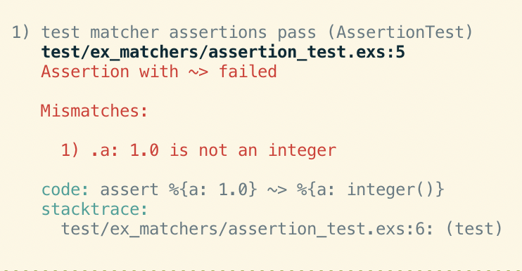

theme: Inter
text: #EEEEEE, line-height(1.4)
text-emphasis: #EEEEEE
code: auto(42), Menlo, line-height(1.2)
footnote: #EEEEEE, text-scale(1.4)
footer-style: #BBBBBB, text-scale(2), alignment(right)
build-lists: true

[.footer: github.com/mtrudel/talks]
#[Fit] Assertions
#[Fit] & Operators
#[Fit] & Atoms
#[Fit] & Macros

---
# Let's talk about tests

---
[.code-highlight: all]
[.code-highlight: 9-13]
[.code-highlight: 7,10]
[.code-highlight: 11]
[.code-highlight: 12,15]

### Let's talk about tests
# 'assert a = b' is often awkward

```elixir
defmodule ExampleTest do
  use ExUnit, async: true

  test "how lame = can be", context do
    response = get_some_data_from_a_controller_or_something() 

    expected_user_id = context.user_id
    
    assert %{
      id: ^expected_user_id,
      name: "a name",
      created_at: created_at
    } = response

    assert created_at.time_zone == "Etc/UTC"
  end
end
```

^ Reads unnaturally

^ Requires pinning (and only to locals!)

^ Test intent is scattered

^ Tests are not exhaustive

---
### Let's talk about tests
# 'assert a = b' is often awkward

* Doesn't read naturally (expectation comes first)
* Requires pinning to test against existing vars
* Test intent is scattered all over the place
* Tests are not exhastive

---
[.code-highlight: all]
[.code-highlight: 7-11]
[.code-highlight: 7]
[.code-highlight: 8]
[.code-highlight: 9]
[.code-highlight: 10]

### Let's talk about tests
# 'assert a == b' is often awkward

```elixir
defmodule ExampleTest do
  use ExUnit, async: true

  test "how lame == can be", context do
    response = get_some_data_from_a_controller_or_something() 

    assert response == %{
      id: context.user_id,
      name: "a name",
      created_at: ???
    }
  end
end
```

^ Is always exhausitve 

^ Requires us to know the *exact* values to expect

^ Only escape valve is to use Map.drop etc.

---
### Let's talk about tests
# 'assert a == b' is often awkward

* Is always exhaustive
* Requires knowing *all* exact expected values up front
* Distinction between `=` and `==` is subtle for newcomers

---
# We can do better

---
# We can do better
#[Fit] Introducing
#[Fit] ExMatchers

---
[.code-highlight: all]
[.code-highlight: 3]
[.code-highlight: 7-12]
[.code-highlight: 8]
[.code-highlight: 9]
[.code-highlight: 10]
[.code-highlight: 11]
### Introducing ExMatchers
# Literate matchers for ExUnit

```elixir
defmodule ExampleTest do
  use ExUnit, async: true
  use ExMatchers

  test "is it rad?", context do
    response = get_some_data_from_a_controller_or_something() 

    assert response ~> %{
      id: context.user_id,
      name: "a name",
      created_at: iso8601_datetime(roughly: :now, time_zone: :utc)
    }
  end
end
```

^ We cover all the shortcomings of both single and double equality asserions

^ Introduce a new operator, the 'squiggle-arrow'. Reads literately, left to
right, as 'matches'

^ Match known values, either as variables or literals

^ Match values against structural comparators called 'matchers'

---
### Introducing ExMatchers
# Literate matchers for ExUnit

* New `~>` operator
* Straightforward literal and var matching
* Powerful & extensible parameteric matching
* Useful error messages

---
### ExMatchers: Building blocks
# Literals match themselves (using `===` semantics)

* `assert "abc" ~> "abc"`
* `assert 123 ~> 123`
* `refute 1 ~> 1.0`

---
### ExMatchers: Building blocks
# Variables act in an obvious way

* Given `str = "abc"`:
* `assert "abc" ~> str`
* `assert str ~> "abc"`
* `assert str ~> str`
* No pinning (Good! Pins are *super* confusing for newcomers)

---
### ExMatchers: Building blocks
# Regexes 'just work' (using `=~` semantics)

* `assert "abc" ~> ~r/abc/`
* `refute "abc" ~> ~r/def/`
* `refute 123 ~> ~r/123/`

---
### ExMatchers: Building blocks
# Matchers allow parametric matching

* `assert "abc" ~> string()`
* `assert 123 ~> integer(postive: true)`
* `assert DateTime.utc_now() ~> datetime(roughly: :now)`
* `refute nil ~> truthy()`

---
### ExMatchers: Building blocks
# Collections can contain anything that matches

* `assert %{a: "abc", b: 123} ~> %{a: "abc", b: integer()}`
* `assert ["abc", 123] ~> ["abc", integer()]`
* `assert {"abc", 123} ~> {"abc", integer()}`
* Collection shapes must be identical (i.e.: same keys, same list/tuple size)

---
### ExMatchers: Building blocks
# Several matchers also defined for collections

* `assert %{a: "abc"} ~> indifferent_access(%{"a" => "abc"})`
* `assert %{a: "abc"} ~> subset_of(%{a: "abc", b: integer()})`
* `assert %{a: "abc", b: 123} ~> superset_of(%{a: "abc"})`
* `assert ["abc", "def"] ~> list_of(string(), min: 1, max: 5)`
* `assert ["def", "abc"] ~> in_any_order(["abc, "def"])`

---
### ExMatchers: Building blocks
# Struct comparison is strict by default

* Struct type equivalence must be exact
* Assuming type equivalence, structs are otherwise compared as maps
* Matching semantics overrideable on your own types via `Matchable` protocol

---
[.code-highlight: all]
[.code-highlight: 8-14]
[.code-highlight: 9]
[.code-highlight: 10]
[.code-highlight: 11]
[.code-highlight: 13]
# End result: Super expressive tests

```elixir
defmodule ExampleTest do
  use ExUnit, async: true
  use ExMatchers

  test "is it rad?", context do
    response = get_some_data_from_a_controller_or_something() 

    assert response ~> %{
      id: context.user_id,
      name: "a name",
      description: string(min: 3, max: 100),
      created_at: iso8601_datetime(roughly: :now, time_zone: :utc),
      tags: list_of(string(empty: false))
    }
  end
end
```

^ Tests read in literate left-to-right style

^ Literals where you want them. Matchers where you want something more
parameteric

^ Especially for acceptance tests, where you don't want to have to dig into your
database or your fixtures to validate your data. created_at is a classic example
here

---
# Demo

^ Show off 'use'

^ Look at test assert

^ Show breaking error by returning nil for id

^ Point out expressive errors

^ Show breaking error by enforcing precision on date

---
### ExMatchers: More Cool Things
# Ergonomic point-of-use

* Simple & obvious matcher syntax
* First class docs
* Easily integrate with LSP
* Useful & specific error messages

^ No macro or dynamic cleverness. Matchers are simple imported functions, works
with LSP for completion / docs

---
[.code-highlight: 4]
### ExMatchers: More Cool Things
# Write your own matchers

```elixir
import PagerDutyPublicIdentifier

assert response ~> %{
  id: pagerduty_public_identifier()
  ...
}
```

---
[.code-highlight: 1-2]
[.code-highlight: 4]
[.code-highlight: 6]
[.code-highlight: 7-10]
### ExMatchers: More Cool Things
# Write your own matchers

```elixir
defmodule PagerDutyPublicIdentifier do
  defstruct version: 2

  def pagerduty_public_identifier(opts \\ []), do: struct(__MODULE__, opts)

  defimpl ExMatchers.Matchable do
    def mismatches(matcher, identifier) do
      if !IdUtils.valid_identifier?(identifier, matcher.version),
        do: [%ExMatchers.Mismatch{message: "Not a valid public identifier"}]
    end
  end
end
```

^ ExMatchers is built on protocol conformance

---
### ExMatchers: More Cool Things
# Matchers compose, DRY up your test assertions

```elixir
assert response ~> %{
  users: list_of(user()),
  org: maybe(organization())
  ...
}
```

---
[.code-highlight: 1]
[.code-highlight: 2-5]
[.code-highlight: 7]
[.code-highlight: 8-9]
### ExMatchers: More Cool Things
# See specific mismatches

```elixir
iex> mismatches = %{a: 1.0, b: %{c: 1.0}} ~>> %{a: integer(), b: %{c: string()}}
[
  %ExMatchers.Mismatch{message: "1.0 is not an integer", path: [:a]},
  %ExMatchers.Mismatch{message: "1.0 is not a string", path: [:b, :c]}
]

iex> ExMatchers.Mismatch.format_mismatches(mismatches)
1) .a: 1.0 is not an integer
2) .b.c: 1.0 is not a string
```

---
### ExMatchers
# Where is it now?

* Overall structure is done
* Basic set of matchers implemented & tested
* Written at Spring 2022 PagerDuty Hack Week. In use on at least one team
* Working with PagerDuty's Community team to get it published
* Hoping for a release sometime this summer
* **Most importantly:** It also needs a new name. Ideas?

---
### ExMatchers: how does it work?

---
### ExMatchers: how does it work?
# WTF is a ~>

---
[.text: #EEEEEE, line-height(1)]
[.footer: https://hexdocs.pm/elixir/main/operators.html]
### Custom operators

* `~>` is an *operator*
* Elixir parses 51 operators:
        ```
        @ + - ! not ** * / + - ++ -- +++ --- .. <> in 'not in'
        |> <<< >>> <<~ ~>> <~ ~> <~>
        < > <= >= == != =~ === !== && &&& and || ||| or => 
        | when <- \\
        ```
* 11 of these have no definition by default:
        ```
        <<< >>> <<~ ~>> <~ ~> <~> &&& ||| +++ ---
        ```

---
[.footer: https://hexdocs.pm/elixir/main/operators.html]
### Custom operators
# Let's implement `~>`

```elixir
defmodule SquiggleArrowOperator do
  def a ~> b, do: "#{a} 🚀 #{b}"
end
```

---
[.footer: https://hexdocs.pm/elixir/main/operators.html]
### Custom operators
# Operators are just functions

* Compiler sees operator as equivalent to a local call of the same name
* e.g.: `1 + 2` is semantically equivalent to `Kernel.+(1, 2)`
* Almost all of the 40 defined operators are implemented similarly in `Kernel` and `Kernel.SpecialForms`
* You can override predefined operators too (change '`+`'!)
  * This is almost always a terrible idea

---
[.footer: https://hexdocs.pm/elixir/main/operators.html]
### Custom operators
# 'Operators as functions' is very useful!

```elixir
iex> [1,2,3] |> Enum.reduce(&Kernel.*/2)
6

iex> [false, true, true] |> Enum.map(&Kernel.!/1)
[true, false, false]
```

---
### Turtles all the way down
# Elixir is mostly written in Elixir

* Almost everything is an operator or a function (even `def`, `fn`, `if`, &c!)
* The fundamental syntax of the language is quite small
* `true`, `false`, `nil` are all atoms under the hood
  * `true === :true #=> true`
  * `%{nil: "nothing"}[nil] #=> "nothing"`

---
[.text: #EEEEEE, line-height(1)]
### ExMatchers: how does it work?
# Useful error messages

* `~>` is a regular operator
* You can use it anywhere (not just in tests)
* But it only returns true or false! How does ExUnit get useful messages?

     
    

---
### ExMatchers: how does it work?
# Macros (melt your brain)

```elixir
defmodule Example do
  def do_func(code) do
    IO.inspect(code, label: "Example.do_func")
    code
  end

  defmacro do_macro(code) do
    IO.inspect(code, label: "Example.do_macro")
    code
  end
end
```

^ Show `1 ~> 2`

^ Parenthetical: Note that if we use an undefined operator such as `<~`, do_macro
will return the AST, but do_func will crash since there is no implementation
defined

^ But this means that we can, well, sort of cheat when we're trying to evaluate
squigge-arrow in the context of tests....

---
### Cheating with operators and marcos
# Let's build some ExUnit magic

```elixir
defmodule Example do
  defmacro do_macro(code) do
    IO.inspect(code, label: "Example.do_macro")
    code
  end
end
```

---
### Cheating with operators and marcos
# Step 1: rename to ExMatchers & assert/1

```elixir
defmodule ExMatchers do
  defmacro assert(code) do
    IO.inspect(code, label: "ExMatchers.assert")
    code
  end
end
```

---
### Cheating with operators and marcos
# Step 2: Do some pattern matching

```elixir
defmodule ExMatchers do
  defmacro assert({:~>, _meta, [left, right]}) do
    IO.inspect(left, label: "ExMatchers.assert left")
    IO.inspect(right, label: "ExMatchers.assert right")
    code
  end
end
```


---
[.footer: \* Somewhat simplified]
### Cheating with operators and marcos
# Step 3: Implement tests

```elixir
defmodule ExMatchers do
  defmacro assert({:~>, _meta, [left, right]}) do
    quote do
      case unquote(left) ~>> unquote(right) do
        [] => 
          true # We passed!
        mismatches =>
          ... # We have access to left and right's ASTs & a list of mismatches
      end
    end
  end
```

---
[.footer: mat@geeky.net - github.com/mtrudel/talks]
### Wrap Up

* ex_matchers is a cool library, coming this summer
* Elixir parses more operators than it implements
* You can override almost any operator (but don't!)
* Operators are just functions
* Macros are equal parts amazing and dangerous
